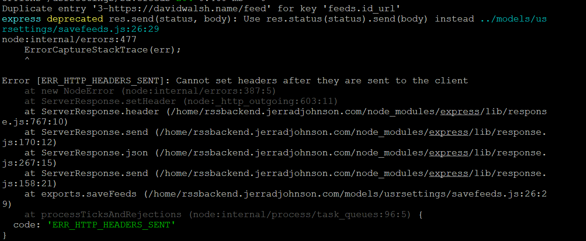

# RSS-Reader. 

## Frontend Setup

Navigate to `/frontend` and run `npm ci`

Then run `npm build`.

## Backend Setup

Navigate to `/backend` and run `npm ci`

Create `pool.js` in `backend/common`, then insert and alter this as appropriate:
```
const mysql = require("mysql");

var pool = mysql.createPool({
    connectionLimit : 10,
    host: 'localhost',
    port: 3306,
    user: 'rss-express-admin',
    password: '***',
    database: 'rss-express',
});

exports.pool = pool;
```

Create `sessionSecret.js` in `backend/common` and insert this and change the key:

```
exports.sessionSecret = "***";
```

In `app.js`, set the origin for CORS.

## Database Setup

```CREATE DATABASE rssexpress;```

Create user and grant privileges:

```
CREATE USER 'rssexpressadmin'@'localhost' IDENTIFIED WITH mysql_native_password BY '***';

GRANT ALL PRIVILEGES ON rssexpress.* TO 'rssexpressadmin'@'localhost';
```

```
CREATE TABLE users (
email VARCHAR(80) UNIQUE NOT NULL,
id INT(8) NOT NULL PRIMARY KEY AUTO_INCREMENT
);

CREATE TABLE options (
user_id INT(8) NOT NULL,
id INT(20) PRIMARY KEY NOT NULL AUTO_INCREMENT,
columns_displayed INT(2) NOT NULL,
max_results_per_column INT(2) NOT NULL
);

CREATE TABLE feeds (
user_id INT(8) NOT NULL,
id INT(20) PRIMARY KEY NOT NULL AUTO_INCREMENT,
feed_url VARCHAR(510) NOT NULL
);

ALTER TABLE feeds ADD UNIQUE INDEX id_url (user_id, feed_url);
ALTER TABLE options ADD UNIQUE INDEX userid (user_id);
```

## Known issues:


   
